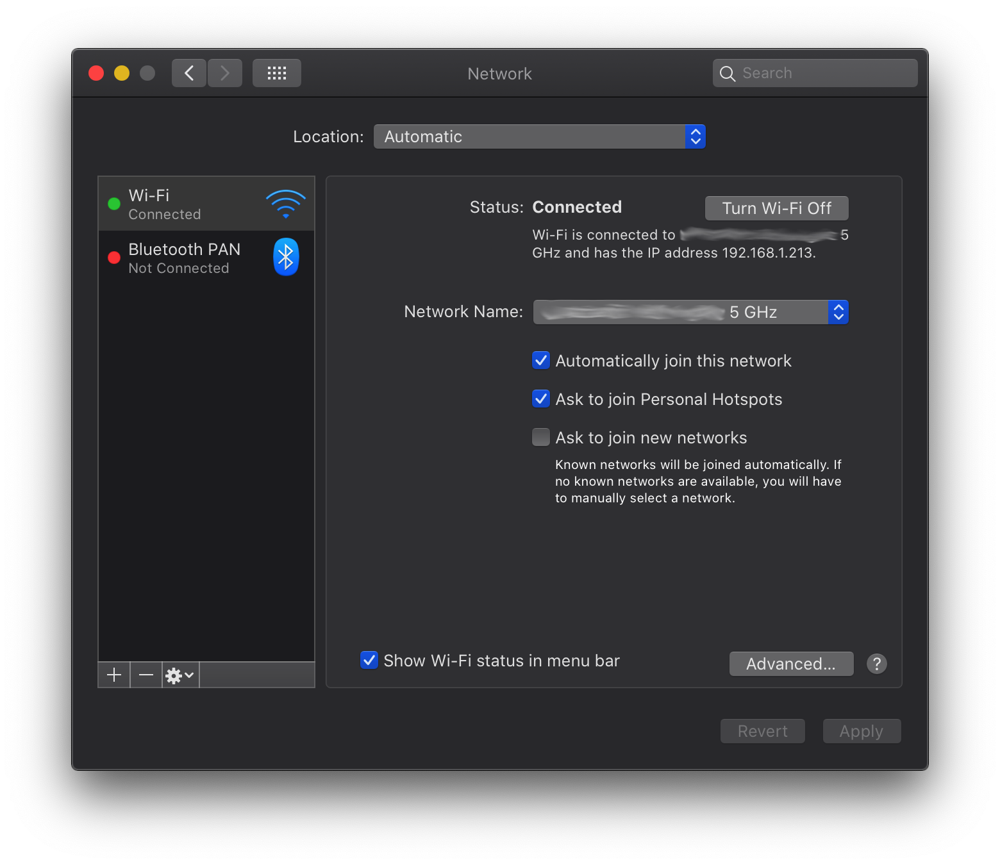
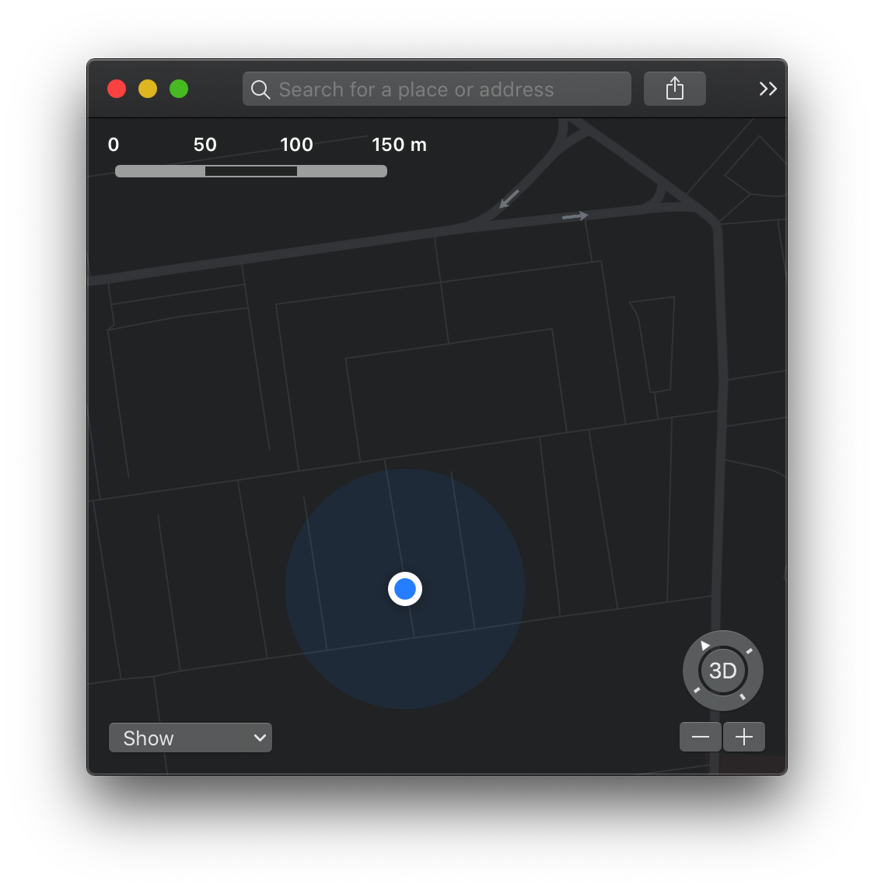

This project joins https://github.com/AppleIntelWifi/Black80211-Catalina and https://github.com/OpenIntelWireless/itlwm to provide a wireless driver for Intel adapters that can be controlled using native  menu item.

 

The driver is recognized by the system as a Wi-Fi adapter, not an Ethernet adapter:





The following actions already work:
- Turning Wi-Fi off and on
- Scanning networks (this also allows Location Services to detect location)



- Connecting to Open, WEP Open System and WPA2 Personal networks using entered password

The following authentication types are not supported:
- WEP Shared Key
- WPA3
- OWE
- All kinds of WPA Enterprise

The following has not been tested:
- WPA Personal (not WPA2)

itlwm should be used from https://github.com/usr-sse2/itlwm

Only macOS Catalina is supported.

### How to load manually:
put Black80211.kext and itlwm.kext in the same folder
```bash
sudo chown -R root:wheel *.kext
sudo chmod -R 755 *.kext
kextutil Black80211.kext -r .
```

### How to load on boot:
- in the installer or Recovery the kexts can be injected with Clover or OpenCore (itlwm should go before Black80211 in OpenCore `config.plist`)
- in an installed system the kexts can't be injected, because macOS omits IO80211Family from the `prelinkedkernel` when there are no wireless drivers for actually present hardware in `/System/Library/Extensions` or `/Library/Extensions`, so itlwm and Black80211 should be installed to `/Library/Extensions`;
- when SecureBoot support is implemented in some future version of OpenCore, the injection would work because the `immutablekernel` used by SecureBoot always contains IO80211Family.
